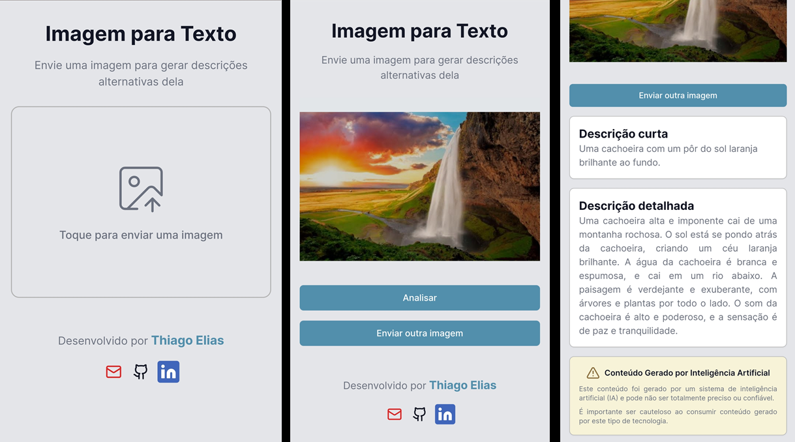

<h1 align="center">Texto a partir de Imagem</h1> 

<p align="center">
<a href="https://nextjs.org/">
  
</a>
<a href="https://www.typescriptlang.org">

</a>
<a href="https://aistudio.google.com/app/">

</a>
<a href="https://gemini.google.com/app">

</a>
</p>

 ## **Motivação do projeto**
 - ***Auxilio em desenvolvimento de aplicações*** front-end e mobile, onde é necessário adicionar uma descrição textual das imagens (*alt*) para ajudar na acessibilidade.
 - Já encontrei muitos casos onde ***essa descrição é mal feita e até ignorada***.
 - Criar uma forma de gerar essa descrição, ***facilitando o trabalho*** do desenvolvedor.

 ## **Descrição do projeto**
 - Projeto desenvolvido com o objetivo de gerar textos descritivos a partir de imagens
 - Gera duas descrições, uma mais direta e outra mais detalhada.
 - Utiliza inteligencia artificial [***Google Gemini***](https://gemini.google.com/app) para transcrição da imagem.
 - Possui interface simple e direta, priorizando o uso em disposivos móveis.
 - Desenvolvida utilizando framework [***Next.Js***](https://nextjs.org/) com linguagem [***Typescript***](https://www.typescriptlang.org/).

 ## **Deploy da aplicação**
[Link da Aplicação Web](https://image-description-seven.vercel.app/)
<p align="center">

</p>

## **Instalação do Projeto**
### **Projeto desenvolvido com Next.js versão 14+.**

### **Requerimentos**
- Instalação do [***Node.js v20+***](https://nodejs.org/en) no computador.
- **API_KEY** para acesso ao [***Google AI Studio***](https://aistudio.google.com/app/)

### **Instalação das dependências**
```bash
npm install
```

### **Configuração das variáveis de ambiente**
- Renomear o arquivo ***env.example*** para ***env.local*** e preencher a informação da API_KEY gerada no [***Google AI Studio***](https://aistudio.google.com/app/).

### **Executar em modo de desenvolvimento**
```bash
npm run dev 
```
